# Module 01: Mapmaking beyond the GUI<!-- omit in TOC -->

Module 01 introduces you to the use of command-line processes to ease data processing and map development. You'll learn how to more effectively use your computer's command-line interface along with other useful geospatial utility libraries such as GDAL/OGR and Mapshaper. The module's assignment challenges you to use these command line tools to generalize and and convert data from various sources for use within a new web map.

**Module Deliverables (20 pts)**

This module consists of two parts:

- Your first task is to follow the instructions detailed below within the lesson (**10pts**). Create the files and directories within this repository, commit messages as you work, and push to the remote. Include a URL link to the repository within the Canvas submission.
- Your second task is to complete [assignment 01](assignment-01.md) (**10pts**). This assignment will be done on a repo hosting on your personal GitHub account (not the NewMapsPlus account). Include a URL link to the repository within the Canvas submission.

You are encouraged to complete the lesson the first week so you have time to resolve questions and work on the assignment the second week.

## TOC<!-- omit in TOC -->

- [Gaining command of GIS processing](#gaining-command-of-gis-processing)
  - [Introduction to the console](#introduction-to-the-console)
    - [Accessing your terminal or command shell](#accessing-your-terminal-or-command-shell)
  - [Recognizing where you are in the system file/directory structure](#recognizing-where-you-are-in-the-system-filedirectory-structure)
  - [Navigating through system directory structure](#navigating-through-system-directory-structure)
  - [Making new directories and files](#making-new-directories-and-files)
  - [Redirecting output to a file](#redirecting-output-to-a-file)
  - [Transferring data from a server with curl](#transferring-data-from-a-server-with-curl)
- [Using Git via the command line](#using-git-via-the-command-line)
  - [Installing Git on your computer system](#installing-git-on-your-computer-system)
  - [Checking the status of your Git repository](#checking-the-status-of-your-git-repository)
  - [Staging files in Git](#staging-files-in-git)
  - [Committing staged files with Git](#committing-staged-files-with-git)
- [Building a project boilerplate](#building-a-project-boilerplate)
  - [Branching with Git](#branching-with-git)
  - [Adding a Leaflet map to our new Git branch](#adding-a-leaflet-map-to-our-new-git-branch)
  - [Merging our new branch back into the master, locally](#merging-our-new-branch-back-into-the-master-locally)
  - [Merging our new branch back into the master on the remote](#merging-our-new-branch-back-into-the-master-on-the-remote)
- [Rocking GDAL with command line GIS](#rocking-gdal-with-command-line-gis)
  - [Installing GDAL/OGR](#installing-gdalogr)
  - [Using OGR to wrangle our Shapefiles into WGS84 GeoJSON files](#using-ogr-to-wrangle-our-shapefiles-into-wgs84-geojson-files)
  - [Unzipping the Shapefiles](#unzipping-the-shapefiles)
  - [Getting information about Shapefiles with ogrinfo](#getting-information-about-shapefiles-with-ogrinfo)
  - [Performing projection and transformations with ogr2ogr](#performing-projection-and-transformations-with-ogr2ogr)
  - [Converting Shapefiles to GeoJSON with ogr2ogr](#converting-shapefiles-to-geojson-with-ogr2ogr)
  - [Multiple asynchronous requests using jQuery](#multiple-asynchronous-requests-using-jquery)
    - [Drawing multiple GeoJSON files to the map](#drawing-multiple-geojson-files-to-the-map)
  - [Extracting features with ogr2ogr](#extracting-features-with-ogr2ogr)
- [Using Mapshaper to simplify linework](#using-mapshaper-to-simplify-linework)
- [Achieving visual hierarchy in web cartography](#achieving-visual-hierarchy-in-web-cartography)
  - [Establishing figure ground](#establishing-figure-ground)
  - [Layering and styling mapped features](#layering-and-styling-mapped-features)
  - [Styling user interaction to match the static design](#styling-user-interaction-to-match-the-static-design)
  - [Adding labels only within a map pane](#adding-labels-only-within-a-map-pane)
- [Moving on to the assignment](#moving-on-to-the-assignment)

## Gaining command of GIS processing

This lesson will introduce you to using the command prompt and guide you through some basic geoprocessing tasks using GDAL/OGR. You'll then use processed data to create a map using Leaflet.js. The lesson also revisits some cartographic design principles to improve the map experience.

### Introduction to the console

The "command line", "terminal", "command prompt", "shell" or "console" is a text-based interface to your computer. It accesses the same processes a graphical user interface (GUI) uses to start programs, run processes, and access system memory.

**Note:** The console in Windows differs significantly from that of Mac OS X, which differs in ways from other Unix/Linux textual interfaces. Most examples within this section of the lesson use the OS X terminal, and I'll mostly be using the term "terminal" throughout the lesson.

I'll provide some examples using the Windows environment, but for Windows-specific commands, you may need to look them up! Using a [cheat sheet for windows command prompt](https://www.makeuseof.com/tag/essential-windows-cmd-commands/) is a good one to keep handy if you're working in a Windows environment.

Here are some additional resources you should skim through now and return to later when puzzling through the lesson tasks and the collaborative mapping assignment.

MacOS:

- [40 Terminal Tips and Tricks You Never Thought You Needed](https://computers.tutsplus.com/tutorials/40-terminal-tips-and-tricks-you-never-thought-you-needed--mac-51192)
- [awesome-osx-command-line](https://github.com/herrbischoff/awesome-osx-command-line)

Windows:

- [How to use the Windows command line (DOS)](https://www.computerhope.com/issues/chusedos.htm)
- [Command Prompt: What It Is and How to Use it](https://www.lifewire.com/command-prompt-2625840)

Windows users may also consider trying out the [console emulator for Windows](http://cmder.net/).

#### Accessing your terminal or command shell

The fastest way to access your terminal in OS X is to use the [Spotlight Search](https://support.apple.com/en-us/HT204014) (command + space) and begin typing `terminal`. Hitting enter will open the terminal, and you'll see an interface that looks like this:

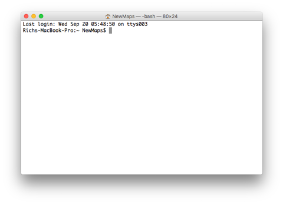  
**Figure 01**. Mac OS terminal.

To open the command prompt in a Windows Environment, you'll want to [follow instructions for your particular Windows OS](https://www.lifewire.com/how-to-open-command-prompt-2618089). Your process is likely one of the following:

- Click Start -> Programs -> Accessories -> Command Prompt
- Click Start (or hit the Windows key), type “cmd” in search, then hit [ENTER].
- Windows Key + R (#r, not the pound symbol) brings up Run. Then type “cmd” then [ENTER].
- SHIFT + right-click in any folder or desktop, then select “open command window here.”

### Recognizing where you are in the system file/directory structure

The terminal or command shell will open to a particular directory within your system, referred to as the "home" directory. This directory is often close to your system's root directory.

It's important to know where you are within the file/directory system when navigating within the terminal. Often one of the quickest ways to establish where you are is to list the files/directories in your current working directory (cwd):

Mac OS:

```bash
ls
```

Windows:

```shell
dir
```

Th `ls` or `dir` command displays the contents of the current working directory. In this this case my cwd is my home directory, which contains these directories and files:

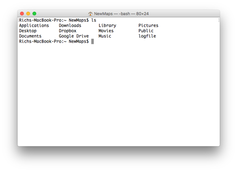  
**Figure 02.** Listing contents of home directory.

Another way to use a command to show the full path to the current working directory:

Mac OS:

```bash
$ pwd
/Users/NewMaps
```

A quick note here about the syntax in these examples. When I include a `$` sign that indicates the command that I typed into the terminal before hitting return. The following lines without the `$` is the resultant output in the terminal.

### Navigating through system directory structure

We can navigate through our file/directory structure using the terminal or console. The `cd` command, or "change directory" is used most often. For instance, I can change directory into the _Documents_ directory with (both Mac OS and Windows):

```bash
$ cd Documents/
```

I can do this because the _Documents_ directory is in my current working directory. I'm using a "relative" path to move into it.

I can also achieve the same with the following command. The period indicates current directory and the slash then tells the system to move into a directory.

```bash
$ cd ./Documents/
```

We can also use "absolute paths" from the system's root directory to move about as well:

```bash
$ cd /Users/NewMaps/Documents/
```

When we begin the path with a forward slash (`/`), the command then takes us to the system's root directory.

Once I'm inside my _Documents_ directory, I can again list the contents of that directory with another `ls` command:

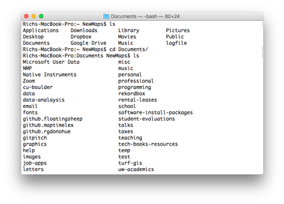  
**Figure 03.** Listing contents of Documents directory.

I can also navigate up one directory with two dots (`..` ) following the `cd` command (both Mac OS and Windows):

```bash
$ cd ..
```

The important thing is to know which directory you're currently in, the **current working directory** or **cwd**. You'll be typing terminal (or shell) commands, and they will attempt to execute upon files within your cwd.

At times, it may be convenient to open your cwd in Finder or Explorer with the `open` command. This allows you to see your files in the conventional GUI:

Mac OS:

```bash
$ open .
```

Windows:

```shell
$ start .
```

The single period designates the current working directory. The previous commands should open the cwd with your familiar GUI Finder or Window.

I could also change into the **Documents** directory by beginning the relative path with a single period.

```bash
$ cd ./Documents/
```

Learning to use a terminal or shell takes time, and this lesson does not intend to provide an exhaustive overview. Practice when you can and search the web for more shortcuts and tricks with which you can experiment. Remember that it's also okay to bounce back and forth between the terminal and your GUI depending on your task.

**Important**: organize your files/directories within a directory such as _Documents_. The "My Documents" for Windows users directory has historically been a pain because of the space in the directory name. **Always avoid using spaces in file and directory names** when working with web and GIS/mapping files!

### Making new directories and files

Start a new terminal session and navigate to your _map675-module-01-username_ directory. This will depend upon where you cloned this repository or organize your New Maps Plus course content.

For example, I may have cloned the repo to my Desktop, and I can now navigate to it with the following command from a new terminal starting at the root of my system using an absolute path:

```bash
$ cd /Users/NewMaps/Desktop/map675-module-01-rgdonohue
```

The directory _map675-module-01-username_ is now my cwd. I can list the contents:

```bash
$ ls
README.md		assignment-01.md	images
```

Create a new directory within it using the `mkdir` command. Create a directory called lesson:

```bash
$ mkdir lesson
```

Then, move to the newly created _lesson_ directory:

```bash
$ cd lesson
```

Note that you can also combine commands. For example, you could have completed the following two commands with a single statement using `&&` (Windows is likely one `&`) between them:

```bash
$ mkdir lesson && cd lesson
```

Create a new file within the _lesson_ directory. Mac OS does this with a `touch` command (Windows may be [a little more complicated](https://stackoverflow.com/questions/1702762/how-to-create-an-empty-file-at-the-command-line-in-windows)).

```bash
$ touch README.md
```

Issuing the `ls` command within the now should indicate that _lesson_ directory now contains a markdown file named README.md.

```bash
$ ls
README.md
```

### Redirecting output to a file

Another way to create files is through what's known as a redirect (this is much easier for Windows users).

In Mac OS we can use the `echo` command followed by text within quotation marks, and then redirect that output to a file. The `echo` command will typically "echo" back that text to the terminal/shell, but in this case, the result of that command is redirected to the target file (as long as we're creating a text file, that is).

```bash
$ echo "#MAP 675" > README.md
```

If you open the **README.md** file now with a text editor, you'll see the text "#MAP 675" within it.

**Warning**: What happened? Note that we overwrote the README.md file and the system didn't prompt us with some warning like "Are you sure you want to overwrite this file?" Overwriting files without being prompted is typical for command processes. We can't be afraid to use the terminal/shell, but we should recognize that files/directories can easily be modified or erased if we're not careful. Always backup important files in another location when using commands.

You can also use the `open` command to open specific files (your OS will attempt to open the file with an appropriate application). Here we're trying to open the **README.md** file in the current working directory:

```bash
$ open README.md
```

Next, create a new directory within the _lesson_ directory named _data_ and navigate within this directory. From within the _lesson_ directory:

```bash
$ mkdir data && cd data
```

We'll now demonstrate another powerful command that allows us to download remote files to our local system using the terminal.

### Transferring data from a server with curl

We can use the [curl command line tool and library](https://curl.haxx.se/) for this (sorry Windows users, but [you'll likely need another option](https://serverfault.com/questions/483754/is-there-a-built-in-command-line-tool-under-windows-like-wget-curl)).

The following command will download the US urban areas shapefile from the [US Census Cartographic Boundary Files](https://www.census.gov/geographies/mapping-files/time-series/geo/carto-boundary-file.html) and save the output within the cwd (which should now be our _data/_ directory.

```bash
$ curl -LOk https://www2.census.gov/geo/tiger/GENZ2018/shp/cb_2018_us_ua10_500k.zip
```

You can list the contents of your _data_ directory and see that the zipped shapefiles have been downloaded and saved to your computer.

One final note before moving on. What's that `-LOk` there that we included after the `curl` command? It's known as a "flag" or option. Most commands have additional options we can access using these flags. Sometimes they're written with two `--` hyphens, and sometimes no hyphens.

This particular flag is actually three options combined into one. The `-L` is telling curl to download the file if the target URL is redirected to another location than the specified URL, the `-O` option tells it to save the request to an output file, and the `-k` will make the connection even if the server connection is considered insecure. You can [read more about the CURL options](https://curl.haxx.se/docs/manpage.html).

Additionally, most command utilities also have a help option we can access with a flag. For instance, we can see all the options available to the `curl` command with `curl -help`.

We've scratched the surface of what you can do with your terminal/shell. Now let's move on to more application-specific uses.

## Using Git via the command line

Many of us have used a Git GUI of some kind ([GitHub Desktop](https://desktop.github.com/) or [GitKraken](https://www.gitkraken.com/), for example). These tools are useful, and there's often no reason not to use them.

However, Git can also be used via the command line as well. You'll want to spend some time looking through the [Git documentation](https://git-scm.com/doc) (there are four short videos at the bottom).

Also, the [become a git guru](https://www.atlassian.com/git/tutorials) tutorials from Atlassian are quite excellent. In particular you should focus on the "[Getting Started](https://www.atlassian.com/git/tutorials/setting-up-a-repository)" and "[Collaborating](https://www.atlassian.com/git/tutorials/syncing)" sections.

### Installing Git on your computer system

First, you'll want to install Git on your system (if you haven't already). If you installed GitHub Desktop, it is likely already installed globally on your system (along with your GitHub user credentials). To check, try the following command:

```bash
$ git --version
git version 2.20.1 (Apple Git-117)
```

If it's installed, you should see an output response in the terminal of something like `git version 2.20.1 (Apple Git-117)`.

If you get a message saying that git isn't a recognized command, then you need to install it on your system. Go to [Git Downloads](https://git-scm.com/downloads) and download and install the appropriate package for your OS.

Once that's done, try `git --version` again to verify things are good.

Take some time to peruse the options available to the `git` command: [git options](https://git-scm.com/docs/git).

Before you begin using Git commands, you'll want to set up your config file, namely your user.name and user.email. The quick [Git Basics Episode 3](https://git-scm.com/video/get-going) is helpful walking you through this process. You can also read through the [Getting Started - First-Time Git Setup](https://git-scm.com/book/en/v2/Getting-Started-First-Time-Git-Setup).

Again, if you already have Git on your system, these config options were likely set up by GitHub Desktop when you installed that.

Let's now practice using git commands.

### Checking the status of your Git repository

Next, we want to see if there are any un-tracked files in our repository. Let's check this status.

```bash
$ git status
```

For example, Git may then tells us that we have a couple of un-tracked files (your output given the above steps will likely show the _lesson_ directory, the _lesson/README.md_ file, and the _lesson/data_ directory along with the zip file we downloaded, rather than what's pictured in Figure 04).

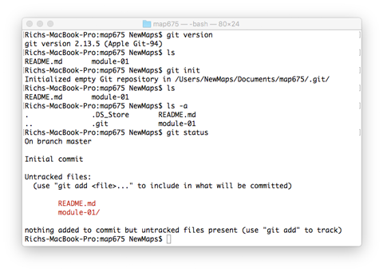  
**Figure 04.** Un-tracked files in Git.

As you may remember, the GitHub Desktop application glosses over a Git step when you commit changes to your repository. It combines the staging step with the commit step. In the terminal, we need to first stage new files/directories or changed files before we can commit them.

### Staging files in Git

To stage a file, we use `git add` and the name of the file. You can then type `git status` to see the updated status:

```bash
$ git add lesson/README.md
$ git status
```

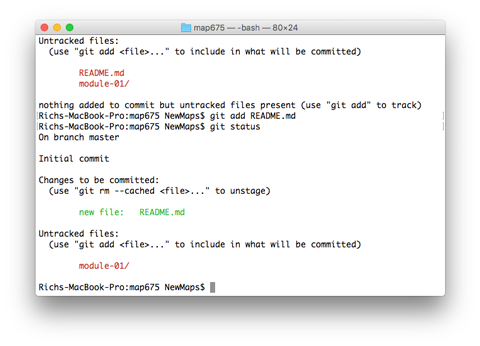  
**Figure 05.** One file staged in Git.

Here we have one file, the **README.md** file staged to be committed. The _lesson_ directory is still not staged.

Adding files one by one like this can get laborious. We can use the `-A` flag to stage all new, modified, and deleted files to the repository (we'll do that more, below). We can also add any new or changed files with the single period, indicating that we want to stage all files/directories in the cwd (`git add .`).

### Committing staged files with Git

Next, we can commit the README.md file. To do this, we use the `git commit` command, which requires a `-m` flag with a commit message. Try this (and check the status after):

```bash
$ git commit -m "add README file"
$ git status
```

Git will output some information about how many files were changed, etc. The `git status` will tell you that you still have the untracked **module-01**.

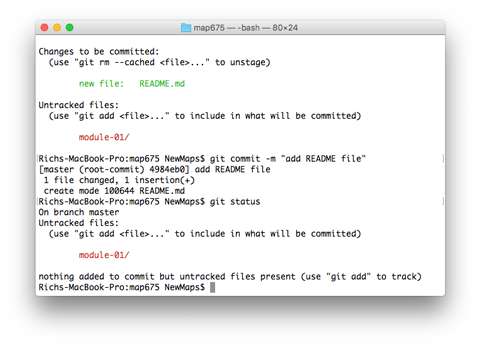  
**Figure 06.** One file committed in Git.

Go ahead and add the _lesson_ directory to the repo and commit it with an appropriate message. After this is successful, typing `git status` will inform you that "nothing to commit, working tree clean."

```bash
$ git status
nothing to commit, working tree clean
```

Congrats, you're now ready to proceed with your file/directory development.

## Building a project boilerplate

It's time to start editing some HTML/CSS/JS in our project. Once again navigate to within your _lesson_ directory with your favorite text editor (e.g., VS Code, Atom, Atom, Sublime, or Brackets). You'll want to keep your terminal open alongside your text editor (or if you're using [an integrated terminal](https://code.visualstudio.com/docs/editor/integrated-terminal)).

**Protip**: Modern text editors also offer support for a terminal integrated within the editor itself. Brackets, Atom, and Sublime have plugins for this, and VS Code comes with an integrated terminal. This can be handy: instead of flipping back and forth between terminal and editor, a shortcut within the editor can toggle the terminal open and closed.

Let's create a _index.html_ file within the root of our _lesson/_ directory.

We can create the _index.html_ file with our terminal (e.g., `touch index.html`) after navigating into the _lesson_ directory. Or you can go the more conventional route and create a new file in your text editor, name it "index.html," and save it within the map675 directory.

Let's start with a basic HTML/CSS template to get us started. Paste the following code within your _index.html_ file and save the changes to the file:

```html
<!DOCTYPE html>

<html lang="en">
  <head>
    <meta charset="utf-8" />

    <title>HTML5 Template</title>

    <style>
      /* CSS rules here */
    </style>
  </head>

  <body>
    <script>
      // JavaScript goes here
    </script>
  </body>
</html>
```

Note: if you're particularly fond of using HTML/CSS templates like Bootstrap, go ahead and use one of these.

Next, in your terminal, check the status of the Git. You'll see output informing you of the current branch, and that you now have an "untracked files":

```bash
Richs-MacBook-Pro:map675 NewMaps$ git status
On branch master
Untracked files:
  (use "git add <file>..." to include in what will be committed)

        index.html

nothing added to commit but untracked files present (use "git add" to track)
```

Go ahead and use Git to add the _index.html_ file to the project and commit the change (with a message like "add index to project").

### Branching with Git

We'll now walk through a straightforward example of how to use branching in Git when developing (an overly simple example, but that's a good place to start).

Let's pretend we want to experiment with adding a Leaflet map to our project, but we're not sure if it'll work. We don't want to mess up our HTML template we've worked so hard on, so we'll create a branch to test out our code first.

Create a new branch in your project named "add-basemap" (no spaces!) with the following command, which will also "checkout" the new branch. Git will output that you've switched to it:

```bash
$ git checkout -b add-basemap
Switched to a new branch 'add-basemap'
```

If you try a `git branch` command now, you'll see both the master and the new add-basemap branches listed, with the add-basemap branch highlighted with a colored asterisk:

```bash
$ git branch
* add-basemap
  master
```

And now typing `git status` will tell you which branch you currently have checked out and if there are any untracked/staged changes:

```bash
$ git status
On branch add-basemap
nothing to commit, working tree clean
```

Next, let's add the necessary HTML, CSS, and JavaScript to get a Leaflet map up and running.

### Adding a Leaflet map to our new Git branch

Let's request the necessary Leaflet CSS and JS from a remote CDN and add them to our project. To refresh:

1. Add the Leaflet CSS within the head of the document:

```html
<link
  rel="stylesheet"
  href="https://unpkg.com/leaflet@1.6.0/dist/leaflet.css"
/>
```

2. Add the Leaflet JS (Rich's preference is toward the bottom, directly before our custom `<script></script>` tags):

```html
<script src="https://unpkg.com/leaflet@1.6.0/dist/leaflet.js"></script>
```

3. Add some custom styles in the head of the document between our `<script></script>` tags to give our map `<div>` tag width and height:

```css
/* select both the body and the map */
body,
#map {
  position: absolute;
  width: 100%;
  top: 0;
  bottom: 0;
  margin: 0;
  padding: 0;
}
```

4. Create the HTML tag to hold our map (within the `<body></body>` tags but before our `<script>` tags):

```html
<div id="map"></div>
```

5. Write the JavaScript to instantiate a new Leaflet map, and add a basemap to it:

```javascript
const options = {
  center: [30, -26],
  zoom: 2,
};

const map = L.map('map', options);

L.tileLayer(
  'https://cartodb-basemaps-{s}.global.ssl.fastly.net/dark_all/{z}/{x}/{y}.png',
  {
    attribution:
      '&copy; <a href="http://www.openstreetmap.org/copyright">OpenStreetMap</a> &copy; <a href="http://cartodb.com/attributions">CartoDB</a>',
    subdomains: 'abcd',
    maxZoom: 19,
  }
).addTo(map);
```

If all went well, we should see a familiar slippy basemap from CARTO, with pan/zoom functionality enabled using Leaflet:

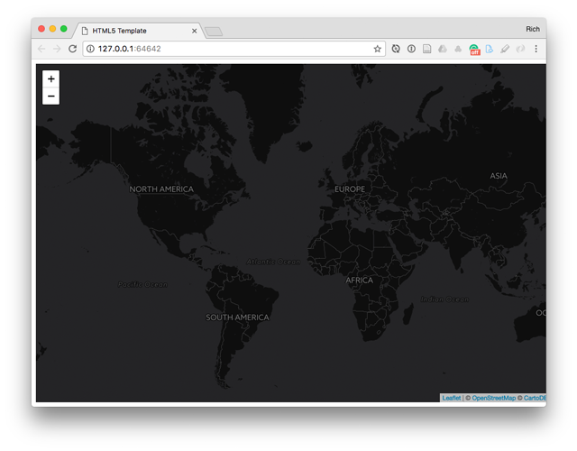  
**Figure 08.** Leaflet map with CARTO's dark basemap.

### Merging our new branch back into the master, locally

If the map loads and doesn't have any errors, we can feel confident that our code is stable and should be merged back into the master branch.

To do this, first switch back to your master branch in the terminal:

```bash
$ git checkout master
Switched to branch 'master'
```

Then merge the 'add-basemap' branch into the master:

```bash
$ git merge add-basemap
Updating 5ed79f8..59d276f
Fast-forward
 index.html | 27 ++++++++++++++++++++++-----
 1 file changed, 22 insertions(+), 5 deletions(-)
```

If all that worked as it should, you can double-check with a `git status` (you'll be writing that one a lot if you haven't sensed that yet):

```bash
$ git status
On branch master
nothing to commit, working tree clean
```

Since you don't need the add-basemap branch anymore, you can feel free to delete it with the `-d` flag. Git will tell you that you've deleted the add-basemap branch. **Important:** you must delete a local branch while on another branch such as the master, not the branch you intend to delete.

```bash
$ git branch -d add-basemap
Deleted branch add-basemap (was 59d276f).
```

Great success! Now that we've made some local changes we like, we can push up the master branch to our remote for sharing and backup.

```bash
$ git push origin master
Counting objects: 6, done.
Delta compression using up to 8 threads.
Compressing objects: 100% (6/6), done.
Writing objects: 100% (6/6), 1.23 KiB | 1.23 MiB/s, done.
Total 6 (delta 0), reused 0 (delta 0)
To https://github.com/rgdonohue/map675.git
   d1120c1..59d276f  master -> master
```

Git outputs some information for us and lets us know that we've written our local copy of the master branch to the remote. Refreshing our browser on the remote GitHub page shows us that our changes have been securely pushed to the remote.

### Merging our new branch back into the master on the remote

Now let's do a similar process, except for merging the branch locally, we'll do it on the remote GitHub account using a "Pull Request." This is the method you'll use when you want to work more collaboratively and have someone else review the code before merging into the master (and the process your instructor uses when helping you debug your code or evaluating your lab submissions).

We'll keep this example simple for now. Let's say we're preparing to make a map of features within the area of Atlanta, GA. We want to swap out the basemap with a lighter one, and constrain the map to that area.

Begin by creating a new branch. Within our terminal, we can do something like following to create a new branch named "focus-map" and check this new branch out. We'll double check with a `git branch` command.

```bash
$ git checkout -b focus-map
Switched to a new branch 'focus-map'

$ git branch
* focus-map
  master
```

Now see that 'focus-map' is now the active branch, and we can change up the code a bit, committing our changes in Git as we go.

We can change the CARTO dark theme to light in the JavaScript. Make the following edits to your HTML file and save the changes.

```javascript
https://cartodb-basemaps-{s}.global.ssl.fastly.net/light_all/{z}/{x}/{y}.png
```

And add and commit that to the repo:

```bash
$ git add index.html
$ git commit -m "change basemap to light"
[focus-map c3a14a9] change basemap to light
 1 file changed, 1 insertion(+), 1 deletion(-)
```

And then we can tweak the Leaflet map options in our JavaScript to constrain the zoom and panning to Atlanta. **Protip:** You can quickly get the zoom, zoomCenter, and zoomBounds properties of the map by typing the `map.getZoom()`, `map.getCenter()`, and `map.getBound()` methods into your Web Developer Console after zooming and mapping to the desired geography within the Leaflet map.

```javascript
const options = {
  center: [33.726, -84.365],
  zoom: 9,
  minZoom: 9,
  maxZoom: 16,
  maxBounds: [
    [33.911, -84.032],
    [33.62, -84.772],
  ],
};

const map = L.map('map', options);
```

This should result in our light colored basemap centered on Atlanta and constrained within bounds and the desired zoom levels.

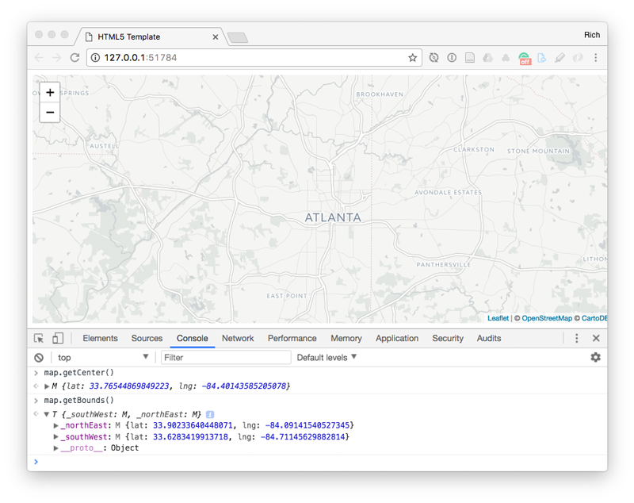  
**Figure 09.** Map centered on Atlanta with light basemap.

Checking our status now, we see we're still on the `focus-map` branch and have unstaged changes to our index.html file:

```bash
git status
On branch focus-map
Changes not staged for commit:
  (use "git add <file>..." to update what will be committed)
  (use "git checkout -- <file>..." to discard changes in working directory)

        modified:   index.html

no changes added to commit (use "git add" and/or "git commit -a")
```

Add and commit these changes:

```bash
$ git add index.html
$ git commit -m "constrain map to Atlanta"
[focus-map 369834d] constrain map to Atlanta
 1 file changed, 8 insertions(+), 2 deletions(-)
```

Now, instead of merging this branch locally, let's push it up to the remote repository and merge it there through a Pull Request.

```bash
git push origin focus-map
Counting objects: 6, done.
Delta compression using up to 8 threads.
Compressing objects: 100% (6/6), done.
Writing objects: 100% (6/6), 787 bytes | 787.00 KiB/s, done.
Total 6 (delta 2), reused 0 (delta 0)
remote: Resolving deltas: 100% (2/2), completed with 1 local object.
To https://github.com/rgdonohue/map675.git
 * [new branch]      focus-map -> focus-map
```

We can now switch back to our remote GitHub page and refresh the page. GitHub may indicate to us that there was a recent branch pushed up which we can "compare & pull request" with the master branch (Figure 10. #1)..

We can also switch the branch we're viewing to the focus-map branch (Figure 10. #2)., where we can examine our commit messages and changes from within the remote client. Note that it also tells us that our focus-map branch is "2 commits ahead of master" (Figure 10. #3).

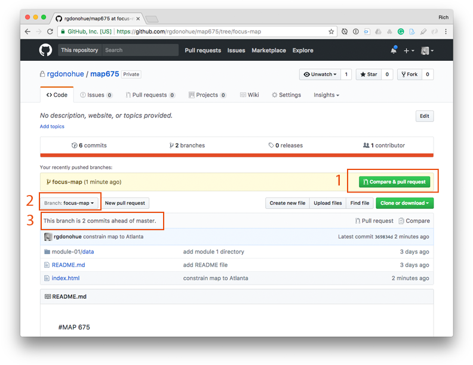  
**Figure 10.** The "focus-map" branch pushed up to GitHub.

GitHub can analyze the changes within the new branch and compare it with the master branch code, letting us know if there will be merge conflicts that we need to resolve before the merge can happen.

If all is good, GitHub gives us a green checkmark and says "Able to Merge." We can merge the changes from the branch into the master. When we're done, we'll see that the commits from the "focus-map" branch are now integrated into the master branch of the project. The merge request automatically closes.

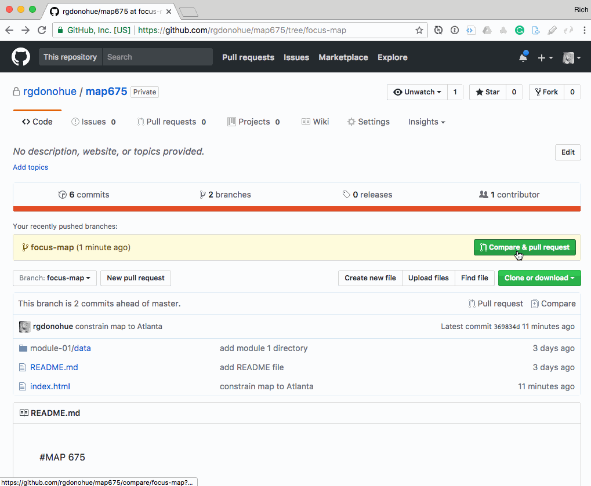  
**Figure 11.** Merging a Pull Request on the Remote GitHub.

Now switch back to your terminal. Switch to your master branch and check the status.

```bash
$ git checkout master
$ git status
On branch master
nothing to commit, working tree clean
```

We see we're currently on the master branch with nothing to commit.

Notice what happens to the code in your editor when you switch back to the master branch. It should have reverted to the previous state of our code, with the dark basemap centered on the whole world.

**Caution:** Your code editor **_should_** have automatically updated when switching branches. You may need to refresh the page in the editor or close and open it. Be careful when switching branches and be sure your editor is reflecting the code captured within the current state of whatever Git branch you're working on.

If we think about what's happened, our master branch on the remote should have been updated with the merge. But our local master branch is still the old code written before we branched into "focus-map".

Let's try pulling our code down from the remote:

```bash
$ git pull origin master
From https://github.com/rgdonohue/map675
 * branch            master     -> FETCH_HEAD
Updating 59d276f..e3d74ba
Fast-forward
 index.html | 12 +++++++++---
 1 file changed, 9 insertions(+), 3 deletions(-)
```

Like magic, our remote updates to the repo are pulled down to the local and the code automatically updated within our text editor. We can check the status:

```bash
$ git status
On branch master
nothing to commit, working tree clean
```

We're ready to continue development. We no longer need the "focus-map" branch since the changes and recorded Git history are now in our master branch. So we can [delete the local and remote branches](https://stackoverflow.com/questions/2003505/how-do-i-delete-a-git-branch-both-locally-and-remotely) if we we choose.

**Summary:** We've covered the basics of using Git via command line to add our changes to the stage, commit these changes with a commit message, push our changes to the remote, create branches, and merge these commits with our master branch both locally and remotely using a Pull Request. There's a lot more we can do with Git, and it takes a while to get comfortable using the commands. To enrich your own learning, practice with small test repositories and seek answers in the documentation provided above and on [Stack Overflow](https://stackoverflow.com/questions/tagged/git).

Let's continue to develop our map of Atlanta and use Git to track our changes as we go.

But first, let's prepare some data to use on the map. In doing so, we're going to use the foundational Geospatial Data Abstraction Library, or GDAL for short.

## Rocking GDAL with command line GIS

GDAL is actually two libraries: one named GDAL, [used to read and manipulate raster data](http://www.gdal.org/gdal_datamodel.html), and another named OGR, [used to read and manipulate vector data](http://www.gdal.org/ogr_arch.html). These libraries are closely associated with the [Open Source Geospatial Foundation](http://www.osgeo.org/) and underlie much of the GIS operations in ArcGIS and QGIS (as well as other open source projects such as Grass).

### Installing GDAL/OGR

The first step is to make sure you have gdal/ogr installed on your computer and that the libraries are accessible globally through the command line.

If you have QGIS installed on your system, it's likely that you already have GDAL/OGR installed and accessible. To test, try the following command in your terminal:

```bash
gdalinfo --version
```

If successful, you should see a version number and release date ouputted in the terminal:

```bash
$ gdalinfo --version
GDAL 3.1.1, released 2020/06/22
```

If not, you'll need to either install it or configure your PATH environmental variables to recognize where on your system the library is installed. Windows users, this latter one may apply to and you should ask your instructor for help after trying this tutorial on [installing gdal for windows](https://sandbox.idre.ucla.edu/sandbox/tutorials/installing-gdal-for-windows). This can be a bit tricky, as sometimes we have multiple versions of GDAL installed on our system, which is okay since different versions of Python, QGIS, and ArcGIS [may require specific versions to operate correctly](https://gis.stackexchange.com/questions/44176/multiple-versions-of-gdal-32bit-and-64bit-on-same-machine).

Windows and Linux users may find it useful to install the [fwtools package](http://fwtools.maptools.org/) which also includes Python alongside GDAL/OGR and some other open source sub packages.

Mac OS users can [install GDAL/OGR with Homebrew](https://trac.osgeo.org/gdal/wiki/BuildingOnMac). If you're a Mac user and you aren't [using Homebrew for installing programs](https://brew.sh/) on your computer, you should be!

Make sure you have gdal installed and can access it from the terminal or shell before proceeding, testing with the version:

```bash
$ gdalinfo --version
GDAL 3.1.1, released 2020/06/22
```

If you see an older version, you may wish to update your installtion of gdal/ogr. I use Homebrew on my MacOS to do this (`brew upgrade gdal`).

We're not going to go too in-depth with GDAL/OGR, but rather the point of this section is to give you more of a sense of how we can access the powerful functionality of geospatial libraries through the command line.

The documentation on the GDAL/OGR site is thorough, but often difficult to easily interpret or consume. A handy cheat sheet is available from [Derek Watkins](https://github.com/dwtkns/gdal-cheat-sheet), a graphics editor at the New York Times. Bostongis also posts an [ogr cheatsheet](http://www.bostongis.com/?content_name=ogr_cheatsheet) you may find useful.

### Using OGR to wrangle our Shapefiles into WGS84 GeoJSON files

**Mapping Scenario**: Let's say Atlanta City wants to build community activities linking their city neighborhoods with the greater metropolitan area. We've been hired by the city of Atlanta to make a map depicting these geographies. We've been instructed to use the following datasets:

- [Neighborhood Statistical Areas](https://opendata.atlantaregional.com/datasets/city-of-atlanta-neighborhood-statistical-areas)
- [Transit_Routes 2019](https://opendata.atlantaregional.com/datasets/transit-routes-2019)
- [cb_2018_us_ua10_500k.zip](https://www2.census.gov/geo/tiger/GENZ2018/shp/cb_2018_us_ua10_500k.zip) (transferred and saved within our _lesson/data/_ directory earlier using the curl example).

Note that though the Atlanta Regional Open Data Portal allows us to access the data in a number of formats (including GeoJSON and file Geodatabase), we'll be downloading the Shapefiles for demonstration purposes below.

Download the files and save them within your _lesson/data_ directory. Your path to this directory from the root of your project should be _map675-module-01-username/lesson/data/_.

**Note:** Since Git tracks text files and not binary files, there's not a lot of sense in using Git commits to track changes in our Shapefiles. Git will still take a snapshot of these files, and we can use GitHub to backup Shapefiles (although sometimes they're way too large). The point is: you don't need to worry about using Git to track changes within a Shapefile.

You can also include the following within your _.gitignore_ file to preclude accidentally committing archived packages of binary files (git has its own compression methods) and Shapefiles in particular:

```bash
# Packages #
############
*.7z
*.dmg
*.gz
*.iso
*.jar
*.rar
*.tar
*.zip

# Shapefiles #
##############
*.dbf
*.fix
*.prj
*.qix
*.shp
*.shx
```

### Unzipping the Shapefiles

Next, move into the data directory within your terminal. If you've downloaded the files correctly and are in the _data/_ directory within your terminal, the command `ls` should list the three files:

```bash
$ ls
City_of_Atlanta_Neighborhood_Statistical_Areas-shp.zip
Transit_Routes_2019-shp.zip
cb_2018_us_county_500k.zip
```

Note that we can use the `-l` flag to see additional information about the files, including the total size of the folder contents, the system permissions to read them, their size, and their date of creation.

```bash
$ ls -l
total 30048
-rw-r--r--@ 1 NewMaps  staff   172397 Jul  6 09:23 City_of_Atlanta_Neighborhood_Statistical_Areas-shp.zip
-rw-r--r--@ 1 NewMaps  staff  5186399 Jul  6 09:23 Transit_Routes_2019-shp.zip
-rw-r--r--  1 NewMaps  staff  9495110 Jul  6 10:04 cb_2018_us_ua10_500k.zip
```

Next, we want to unzip these files. You can do this manually within the GUI of your OS and some default application ([7-zip](http://www.7-zip.org/) is a good one for Windows users). You can also do it with the terminal!

Here's how you'd do it using the Mac OS terminal (Windows, [Stack Overflow is your friend](https://stackoverflow.com/questions/17546016/how-can-you-zip-or-unzip-from-the-command-prompt-using-only-windows-built-in-ca)).

```bash
$  unzip City_of_Atlanta_Neighborhood_Statistical_Areas-shp.zip -d City_of_Atlanta_Neighborhood_Statistical_Areas-shp
  inflating: Atlanta_City_Limits/GeopoliticalArea.shp
  inflating: Atlanta_City_Limits/GeopoliticalArea.prj
 extracting: Atlanta_City_Limits/GeopoliticalArea.cpg
  inflating: Atlanta_City_Limits/GeopoliticalArea.dbf
  inflating: Atlanta_City_Limits/GeopoliticalArea.shx
```

Note that the `-d` flag creates a destination directory, rather than unzipping the files directly into the _data/_ directory.

Also note that whomever curated this GIS dataset did a poor job of following best practices: it's annoying and challenging to have 1.) the original file name of the zip contain both underscores and a hyphen at the end, 2.) the internal Shapefile names do not match the containing zip file.

Also, if you're typing out the full names of those file/directory paths, you must be thinking "this isn't efficient at all!" Try typing the beginning letters of your target file/directory and then hit the tab key on your keyboard (sometimes a few times). You can cycle through available options and choose your file.

Repeat this process for the other three zipped Shapefiles. You can then inspect the directory contents, noting that we have the zipped Shapefiles and the their unzipped directories:

```bash
$ ls -l
total 30048
drwxr-xr-x@ 7 NewMaps  staff      224 Jul  6 10:10 City_of_Atlanta_Neighborhood_Statistical_Areas-shp
-rw-r--r--@ 1 NewMaps  staff   172397 Jul  6 09:23 City_of_Atlanta_Neighborhood_Statistical_Areas-shp.zip
drwxr-xr-x@ 7 NewMaps  staff      224 Jul  6 10:12 Transit_Routes_2019-shp
-rw-r--r--@ 1 NewMaps  staff  5186399 Jul  6 09:23 Transit_Routes_2019-shp.zip
drwxr-xr-x  9 NewMaps  staff      288 Jul  6 10:13 cb_2018_us_ua10_500k
-rw-r--r--  1 NewMaps  staff  9495110 Jul  6 10:04 cb_2018_us_ua10_500k.zip
```

We no longer need to keep the original zipped files, so we may wish to delete them to save space (and so we don't commit and push unnecessary files to the remote). The following command will remove all files in the current directory with the .zip extension.

```bash
$ rm -rf ./*.zip
```

Next, within the terminal navigate into the _Transit_Routes_2019-shp_ directory and list the contents. We can see the five files that actually comprise this "single" Shapefile:

```bash
$ cd Transit_Routes_2019

$ ls -l
total 16352
-rw-r--r--@ 1 NewMaps  staff        5 Jul  6 09:03 Transit_Routes_2019.cpg
-rw-r--r--@ 1 NewMaps  staff   159689 Jul  6 09:03 Transit_Routes_2019.dbf
-rw-r--r--@ 1 NewMaps  staff      143 Jul  6 09:03 Transit_Routes_2019.prj
-rw-r--r--@ 1 NewMaps  staff  8195884 Jul  6 09:03 Transit_Routes_2019.shp
-rw-r--r--@ 1 NewMaps  staff     4508 Jul  6 09:03 Transit_Routes_2019.shx
```

### Getting information about Shapefiles with ogrinfo

First, we want to find out some information about these Shapefiles. The command `ogrinfo` is our huckleberry for this. We'll include the flag `-so` so it doesn't output all of the feature information. The command takes two additional arguments. The first is the name of the file from which we wish to extract information and the second is the name of the first and only layer within a Shapefile, which shares the exact name of the Shapefile itself (without the .shp extension).

**Note:** If you're rusty on your Shapefile specification, you can always read the [ESRI Shapefile Technical Description](https://www.esri.com/library/whitepapers/pdfs/shapefile.pdf) for some relaxing evening entertainment.

Next, try the following command.

```bash
$ ogrinfo -so Transit_Routes_2019.shp Transit_Routes_2019
```

The summary only information includes useful information such as the feature count, the projected extent of the Shapefile, the projection and coordinate reference system of the Shapefile (very important!), and a list of the data attribute columns from within the Shapefile's .dbf file.

```bash
INFO: Open of `Transit_Routes_2019.shp'
      using driver `ESRI Shapefile' successful.

Layer name: Transit_Routes_2019
Metadata:
  DBF_DATE_LAST_UPDATE=2020-07-06
Geometry: Line String
Feature Count: 551
Extent: (-84.773567, 33.381103) - (-83.905518, 34.230133)
Layer SRS WKT:
GEOGCRS["WGS 84",
    DATUM["World Geodetic System 1984",
        ELLIPSOID["WGS 84",6378137,298.257223563,
            LENGTHUNIT["metre",1]]],
    PRIMEM["Greenwich",0,
        ANGLEUNIT["degree",0.0174532925199433]],
    CS[ellipsoidal,2],
        AXIS["latitude",north,
            ORDER[1],
            ANGLEUNIT["degree",0.0174532925199433]],
        AXIS["longitude",east,
            ORDER[2],
            ANGLEUNIT["degree",0.0174532925199433]],
    ID["EPSG",4326]]
Data axis to CRS axis mapping: 2,1
OBJECTID: Integer (4.0)
GlobalID: String (38.0)
last_edite: Date (10.0)
id: String (4.0)
short_name: String (7.0)
long_name: String (67.0)
direction: String (59.0)
rte_type: String (27.0)
rte_color: String (6.0)
agency_id: String (8.0)
agency_nam: String (44.0)
gen_date: Date (10.0)
end_date: Date (10.0)
```

We can see that this Shapefile is projected and based upon WGS84 (good for our web mapping intentions!).

Repeat the `ogrinfo -so` for the dataset of neighborhood statistical areas. What can you learn about this dataset?

### Performing projection and transformations with ogr2ogr

Repeat the `ogrinfo -so` for the dataset of urban areas dataset from the Cartographic Boundary Shapefiles.

```bash
$ ogrinfo -so cb_2018_us_ua10_500k.shp cb_2018_us_ua10_500k
```

Interrogating the urban areas reveals that this dataset is unprojected but using a different coordinate reference system (NAD 83).

```bash
INFO: Open of `cb_2018_us_ua10_500k.shp'
      using driver `ESRI Shapefile' successful.

Layer name: cb_2018_us_ua10_500k
Metadata:
  DBF_DATE_LAST_UPDATE=2019-04-15
Geometry: Polygon
Feature Count: 3601
Extent: (-170.789384, -14.373740) - (145.790884, 71.306845)
Layer SRS WKT:
GEOGCRS["NAD83",
    DATUM["North American Datum 1983",
        ELLIPSOID["GRS 1980",6378137,298.257222101,
            LENGTHUNIT["metre",1]]],
    PRIMEM["Greenwich",0,
        ANGLEUNIT["degree",0.0174532925199433]],
    CS[ellipsoidal,2],
        AXIS["latitude",north,
            ORDER[1],
            ANGLEUNIT["degree",0.0174532925199433]],
        AXIS["longitude",east,
            ORDER[2],
            ANGLEUNIT["degree",0.0174532925199433]],
    ID["EPSG",4269]]
Data axis to CRS axis mapping: 2,1
UACE10: String (5.0)
AFFGEOID10: String (14.0)
GEOID10: String (5.0)
NAME10: String (100.0)
LSAD10: String (2.0)
UATYP10: String (1.0)
ALAND10: Integer64 (14.0)
AWATER10: Integer64 (14.0)
```

We can use OGR to perform both projection and CRS transformations. To accomplish this we use the powerful `ogr2ogr` command, which additionally allows us to make all sorts of conversions between vector file formats (as we'll see below).

We can convert this Shapefile to WGS84 for our web mapping needs using the `-t_srs` flag. Note that our output file is listed first, followed by the input file:

```bash
$ ogr2ogr cb_2018_us_ua10_500k_4326.shp -t_srs "EPSG:4326" cb_2018_us_ua10_500k.shp
```

If successful, OGR creates a new set of Shapefiles named _cb_2018_us_ua10_500k_4326.shp_. We can now use our `ogrinfo` command to see the information about the newly created Shapefile.

```bash
$ ogrinfo -so cb_2018_us_ua10_500k_4326.shp cb_2018_us_ua10_500k_4326
```

We know that with one simple command, we've successfully converted this Shapefile from NAD83 to the unprojected WGS84.

```bash
INFO: Open of `cb_2018_us_ua10_500k_4326.shp'
      using driver `ESRI Shapefile' successful.

Layer name: cb_2018_us_ua10_500k_4326
Metadata:
  DBF_DATE_LAST_UPDATE=2020-07-06
Geometry: Polygon
Feature Count: 3601
Extent: (-170.789384, -14.373740) - (145.790884, 71.306845)
Layer SRS WKT:
GEOGCRS["WGS 84",
    DATUM["World Geodetic System 1984",
        ELLIPSOID["WGS 84",6378137,298.257223563,
            LENGTHUNIT["metre",1]]],
    PRIMEM["Greenwich",0,
        ANGLEUNIT["degree",0.0174532925199433]],
    CS[ellipsoidal,2],
        AXIS["latitude",north,
            ORDER[1],
            ANGLEUNIT["degree",0.0174532925199433]],
        AXIS["longitude",east,
            ORDER[2],
            ANGLEUNIT["degree",0.0174532925199433]],
    ID["EPSG",4326]]
Data axis to CRS axis mapping: 2,1
UACE10: String (5.0)
AFFGEOID10: String (14.0)
GEOID10: String (5.0)
NAME10: String (100.0)
LSAD10: String (2.0)
UATYP10: String (1.0)
ALAND10: Integer64 (14.0)
```

We've now successfully converted all our Shapefiles to the same coordinate reference system. Our next step is to convert these Shapefiles to GeoJSON format so we can load them into our Leaflet map.

Before moving on we can remove the other urban area files using the NAD 83 CRS from the _cb_2018_us_ua10_500k_4326_ subdirectory.

### Converting Shapefiles to GeoJSON with ogr2ogr

Our next task is to convert our Shapefiles to a more appropriate format for webmapping: GeoJSON. For this, we'll again use the `ogr2ogr` command with the `-f` flag to change the format.

Navigate to within the _cb_2018_us_ua10_500k_4326_ subdirectory use following command for the file conversion:

```bash
$ ogr2ogr -f "GeoJSON" ../urban-areas.json cb_2018_us_ua10_500k_4326.shp
```

Note that for the name of the output JSON file, I've switched from the underscores which are useful for Shapefiles and dealing with Arc/ESRI products in general to the more web-friendly hyphens (and I've named the file with lowercase). These are largely my preferred conventions for naming GeoJSON files (and web files and directories in general). Pick your own, but be consistent!

Also, note that the above command assumes my cwd is within the _cb_2018_us_ua10_500k_4326_ subdirectory. However, I'm telling ogr2ogr to go up one level to write my _urban-areas.json_ file with the `../urban-areas.json`. This will output the file up one level within the root of the _data_ directory.

Now repeat this procedure for the other two Shapefiles, renaming them to a shorter, more manageable and web-friendly filenames such as _atlanta-neighborhoods.json_ and _atlanta-transit-routes.json_. Remember you need to think carefully about what directory you're current within when trying to access specific files.

From within the root of the _data/_ directory, you should now have 3 GeoJSON files and 3 Shapefile subdirectories:

```bash
$ ls -li
total 97152
8651724560 drwxr-xr-x@ 7 NewMaps  staff       224 Jul  6 10:10 City_of_Atlanta_Neighborhood_Statistical_Areas-shp
8651724661 drwxr-xr-x@ 7 NewMaps  staff       224 Jul  6 10:12 Transit_Routes_2019-shp
8651727203 -rw-r--r--  1 NewMaps  staff    802708 Jul  6 11:18 atlanta-neighborhoods.json
8651727226 -rw-r--r--  1 NewMaps  staff  23113421 Jul  6 11:18 atlanta-transit-routes.json
8651724672 drwxr-xr-x  7 NewMaps  staff       224 Jul  6 10:48 cb_2018_us_ua10_500k
8651726913 -rw-r--r--  1 NewMaps  staff  24781649 Jul  6 11:05 urban-area.json
```

Let's now move ahead and load these GeoJSON files into our DOM to be drawn on the Leaflet map using Leaflet JS.

### Multiple asynchronous requests using jQuery

We'll need an asynchronous way to load the files into the script.

JQuery offers an easy enough way to load multiple files with the [\$.when() method](https://api.jquery.com/jquery.when/). First, load JQuery into your script (place this request after we've requested the Leaflet JavaScript but before our custom `<script></script>` tags:

```html
<script
  src="https://code.jquery.com/jquery-3.2.1.min.js"
  integrity="sha256-hwg4gsxgFZhOsEEamdOYGBf13FyQuiTwlAQgxVSNgt4="
  crossorigin="anonymous"
></script>
```

Next, we can write some code to request all our data files. Note that all of my GeoJSON data files are directly within the _data/_ directory (not within their respective Shapefile folders).

```javascript
$.when(
  $.getJSON('data/urban-areas.json'),
  $.getJSON('data/atlanta-neighborhoods.json'),
  $.getJSON('data/atlanta-transit-routes.json')
).done(function (urbanAreasData, neighborhoodsData, transitRoutesData) {
  //  note that we can access the GeoJSON data here
  console.log(neighborhoodsData);
});
```

#### Drawing multiple GeoJSON files to the map

Let's try drawing all these data to the map. First, if we use the jQuery approach:

```javascript
$.when(
  $.getJSON('data/urban-areas.json'),
  $.getJSON('data/atlanta-neighborhoods.json'),
  $.getJSON('data/atlanta-transit-routes.json')
).done(function (urbanAreasData, neighborhoodsData, transitRoutesData) {
  L.geoJson(urbanAreasData).addTo(map);
  L.geoJson(neighborhoodsData).addTo(map);
  L.geoJson(transitRoutesData).addTo(map);
});
```

It takes a while even on our local machine to load the large files, but once the data is in the DOM Leaflet does an impressive job of drawing the large, complex geometries to the map.

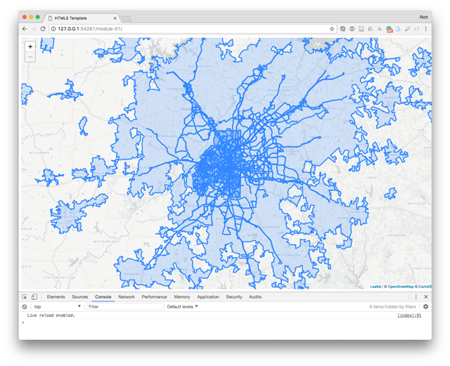  
**Figure 12.** Our four GeoJSON files drawn to the Leaflet map with default styling options.

However, go into your Developer Tools, choose the "Network" tab, and then refresh the page. This tells us about all the requests we're making to our web document. At the lower right, we see that more than 49MB MB of data was transferred. You can dig around in your Dev Tools to emulate how long this would take on a (slow) network connection. Either way, we know it's way too much.

If we check the file sizes of our output files in the _data/_ directory as well, the _atlanta-transit-routes.json_ is 23.1MB and the _urban-areas.json_ is a 24.7MB, both of which are too large for loading into a web map. We'll have to deal with this a bit before we use them in our "production" Leaflet map (i.e., not the "development" map we can run and test locally, which will load much faster than over the network).

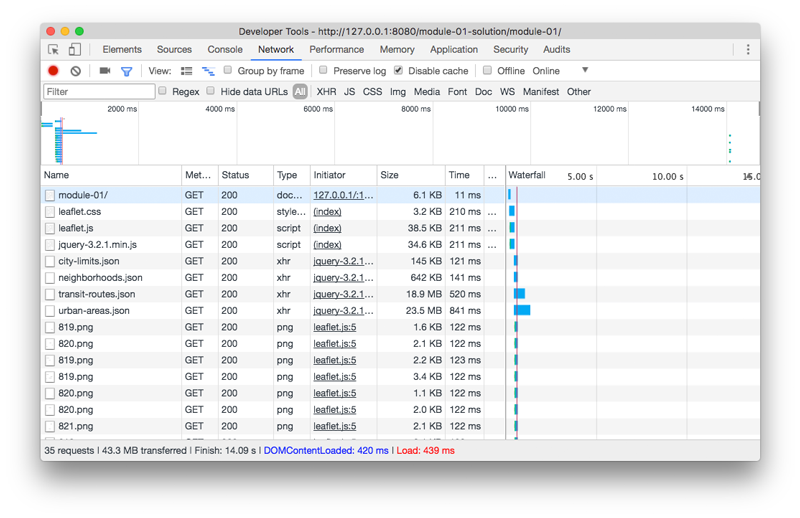  
**Figure 13.** The Developer Toolbar Network tab.

Before we move on to another command line utility, let's demonstrate one more powerful aspect of GDAL/OGR. If we think about the urban areas Shapefile and GeoJSON we're working with, we know that it's the entire US. We don't need all those polygons. So we want to filter out the one that's the Atlanta urban area. We can use `ogr2ogr` to do this too!

### Extracting features with ogr2ogr

From within the _data_ directory, the following command will take our huge _urban-areas.json_ file, select all the features where "NAME10 = 'Atlanta, GA'" (there's only one), and create a new GeoJSON file named _atlanta-urban.json_;

```bash
ogr2ogr -f "GeoJSON" -where "NAME10='Atlanta, GA'" atlanta-urban.json urban-areas.json
```

Walah! We now have a GeoJSON file that only contains our Atlanta urban area footprint, and the file is only 241kb. We can modify our Leaflet script to load this file instead, drastically improving the load time.

We can further reduce the size of our neighborhoods dataset, which contain attribute information beyond the name that we may not want or need. Rather than removing unneeded geometries from a data file, we can produce another GeoJSON file with properties stripped out using the `-select` option (again, see the [ogr2ogr documentation](https://gdal.org/programs/ogr2ogr.html)).

```bash
ogr2ogr -f "GeoJSON" -select NEIGHBORHO atlanta-neighborhoods-filtered.json atlanta-neighborhoods.json
```

Not that in this case, filtering out the other properties only decreased the file size from 803kb to 766kb, so not a terrific improvement. However, it would be useful for datasets with many more features and additional properties.

Once we have this command available to us, we can produce a GeoJSON file containing only our desired fields from a Shapefile without even opening up a GIS!

We can even trim the coordinate precision of those long lat/lng values:

```bash
ogr2ogr -f "GeoJSON" -lco COORDINATE_PRECISION=5 -sql "select NEIGHBORHO from City_of_Atlanta_Neighborhood_Statistical_Areas" atlanta-neighborhoods-filtered3.json City_of_Atlanta_Neighborhood_Statistical_Areas-shp/City_of_Atlanta_Neighborhood_Statistical_Areas.shp
```

Note the file sizes of the neighborhood GeoJSON files. Our original _atlanta-neighborhoods.json_ was 803kb. Removing the extra data attributes brought this down to 766kb. But reducing the coordinate precision dropped the file size down to 431kb. What does this tell us?

Ogr2ogr is a powerful command line utility within the GIS and geospatial data science world. We've covered a few examples of how to use it to 1.) interrogate and better understand spatial datasets we run across, 2.) make project and CRS transformations to spatial datasets, 3.) convert spatial datasets from one format to another, and 4.) further filter geometries and property information within these datasets. These operations constitute much of GIS work ... all without even opening QGIS or ArcGIS.

One final note before moving on for you to consider and further research on your own: OGR additionally supports two dialects: [OGR SQL](http://www.gdal.org/ogr_sql.html) and [OGR SQLite SQL](http://www.gdal.org/ogr_sql_sqlite.html).

For example, we can achieve the same output as the previous command with sql (note that we need to perform this on the Shapefile and not the neighborhoods.json file we produced earlier). **Caution:** Note that I'm naming the new file **neighborhoods-filtered2.json** as ogr2ogr will overwrite the **neighborhoods-filtered.json** file without warning!

```bash
ogr2ogr -f "GeoJSON" -sql "select NEIGHBORHO from City_of_Atlanta_Neighborhood_Statistical_Areas" atlanta-neighborhoods-filtered2.json City_of_Atlanta_Neighborhood_Statistical_Areas-shp/City_of_Atlanta_Neighborhood_Statistical_Areas.shp
```

## Using Mapshaper to simplify linework

We also noticed that our _atlanta-transit-routes.json_ file is very large at 23.1 MB. What do we do about these transit lines? Let's turn to another tool now to help us with that.

Mapshaper is a fantastic tool written by [Matt Bloch](https://github.com/mbloch) (a graduate of UW-Madison's esteemed Cartography program and currently a New York Times graphics editor).

- [Mapshaper on GitHub](https://github.com/mbloch/mapshaper)
- [the web-based Mapshaper tool](https://github.com/mbloch/mapshaper)
- [Command Reference for Mapshaper](https://github.com/mbloch/mapshaper/wiki/Command-Reference)

Mapshaper's primary value added is its ability to generalize linework of overly-detailed files with its [simplify command](https://github.com/mbloch/mapshaper/wiki/Command-Reference#-simplify), which we'll be using now.

However, as you'll come to appreciate, Mapshaper offers a powerful command-line GIS that can complete many other geocomputation tasks such as file conversion, merging files, extracting features from files, and calculating information based on attribute and geometry data.

To get a sense of what the command tools will do, first try importing your transit-routes.json file into the web interface at [http://mapshaper.org/](http://mapshaper.org/) (it may take a while to upload because it's such a big file).

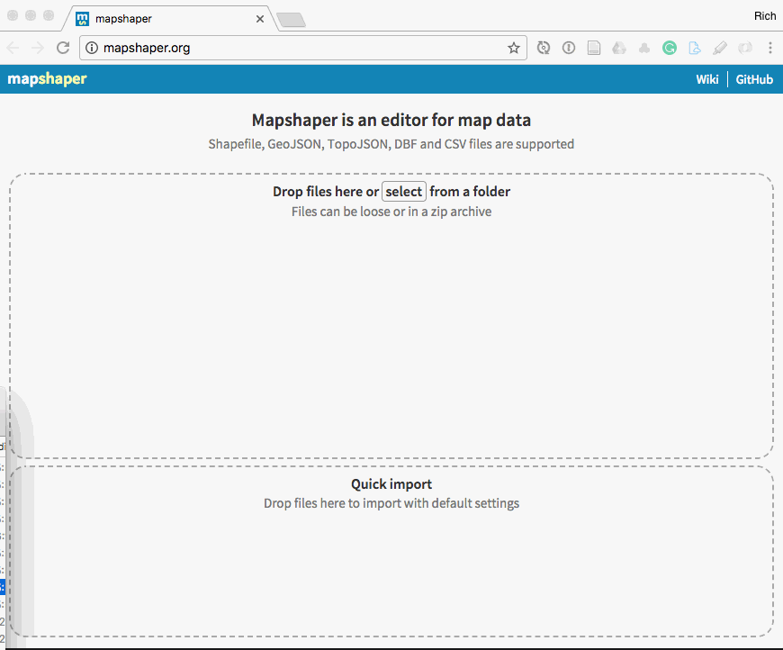  
**Figure 14.** Simplifying linework in the Mapshaper web GUI.

Choose simplify and try dragging the slider down to preserve only 1% of the exisiting vertices. You'll see that we haven't really lost the shape of the geometries. Downloading this file will produce a file only 3.3 MB in size (compared to the previous 19.8MB). Quite an improvement!

The important thing for us now is that Mapshaper helped drastically reduce the size of the transit routes file. Once we load these new (smaller) files into our map, we can again check the page load to confirm that we've brought the data transfer down to a reasonable size:

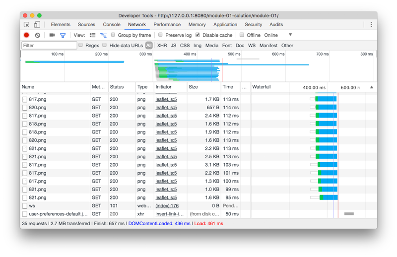  
**Figure 15.** The Developer Toolbar Network tab shows we've reduced the data transfer to 2.7 MB.

Mapshaper has a powerful command line API as well. Using the command line with Mapshaper on your local machine requires having Node.js installed, however, which we'll be covering in Module 02. Can you wait!?If you can't wait, note that [Mapshaper](http://mapshaper.org/) has an impressive Console built into the web interface.

## Achieving visual hierarchy in web cartography

Have you reached the point when you're thinking, "okay, where's the web cartography?" Let's return to our _index.html_ file, where we're currently writing the HTML/CSS/JavaScript to make our application and page work as we'd like.

I'm going to work with a dark motif for this map. First I'm going to give the map a dark background. I'll remove the CARTO tilelayer all together. For this map I'll try creating a map without the help of those tiles.

I've also adjusted the map options to the following to begin the section of the lesson. Here is the full index.html file from this point moving forward:

```html
<!DOCTYPE html>

<html lang="en">
  <head>
    <meta charset="utf-8" />

    <title>Atlanta Urban Geographies</title>
    <link
      rel="stylesheet"
      href="https://unpkg.com/leaflet@1.6.0/dist/leaflet.css"
    />
    <style>
      body,
      #map {
        position: absolute;
        width: 100%;
        top: 0;
        bottom: 0;
        margin: 0;
        padding: 0;
        background: rgba(0, 0, 0, 0.75);
      }
    </style>
  </head>

  <body>
    <div id="map"></div>

    <script src="https://unpkg.com/leaflet@1.6.0/dist/leaflet.js"></script>
    <script
      src="https://code.jquery.com/jquery-3.2.1.min.js"
      integrity="sha256-hwg4gsxgFZhOsEEamdOYGBf13FyQuiTwlAQgxVSNgt4="
      crossorigin="anonymous"
    ></script>
    <script>
      const options = {
        center: [33.726, -84.365],
        zoom: 9,
        minZoom: 9,
        maxZoom: 16,
        maxBounds: [
          [33.911, -84.032],
          [33.62, -84.772],
        ],
      };
      const map = L.map('map', options);

      $.when(
        $.getJSON('data/urban-areas.json'),
        $.getJSON('data/atlanta-neighborhoods.json'),
        $.getJSON('data/atlanta-transit-routes.json')
      ).done(function (urbanAreasData, neighborhoodsData, transitRoutesData) {
        drawMap(urbanAreasData, neighborhoodsData, transitRoutesData);
      });

      function drawMap(urbanAreasData, neighborhoodsData, transitRoutesData) {
        L.geoJson(urbanAreasData).addTo(map);
        L.geoJson(neighborhoodsData).addTo(map);
        L.geoJson(transitRoutesData).addTo(map);
      }
    </script>
  </body>
</html>
```

And at this point it's creating a map that looks like this:

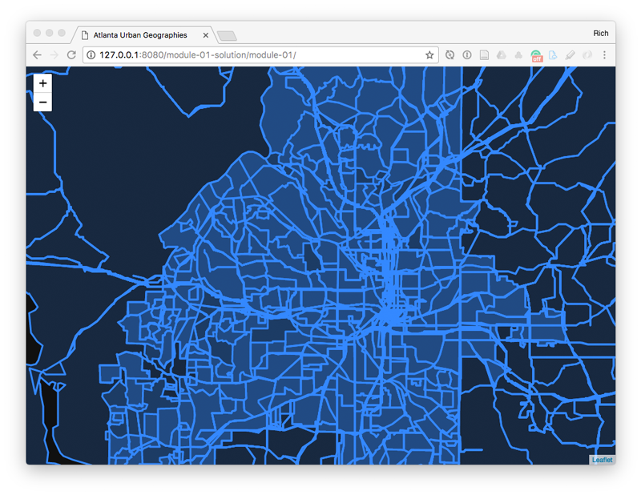  
**Figure 16.** Leaflet map with mess of four layers drawn with default settings.

We want to look at this map for a moment and think about what we're seeing, and we need minimially two perspectives to do this effectively: a cognitive/phyical one and a cartographic one.

### Establishing figure ground

From the perpective of the first, the eye-brain system doesn't know how to look at this mess of blue. It tells us that toward the center of the metro extent of Atlanta there exists a lot of data in the other files. Other than that, we don't know what is what.

From the cartographic perspective we can respond to this observation. Yes, these two work hand in hand. One of our first impulses as cartographers is to establish 1. a figure/ground perspective, and 2. from this a visual hierarchy.

Let's consider figure ground first.

The CARTO tiles basemap can be considered the ground. The drawn data layers on top of it can be considered the figure. These two are very easily established because when we have a dark ground and light (bright blue) figure. We can easily establish one from the other.

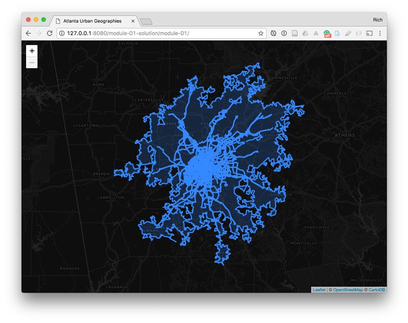  
**Figure 17.** Strong establishement of figure ground.

Let's consider the opposite extreme. What if the figure and ground of these datasets &mdash; the CARTO basemaps and the data layers we've loaded were more similiar in style?

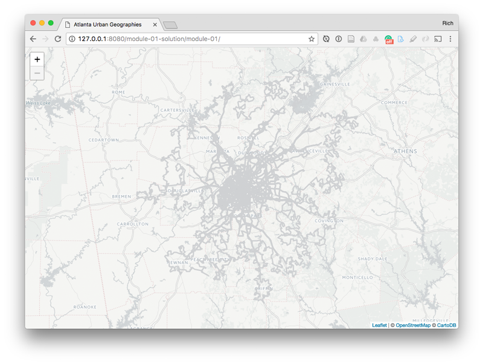  
**Figure 18.** Weak establishement of figure ground.

This becomes much less effective for the user. The eye-brain system needs to work much harder to even establish what the focus of the map is.

Creating an effective visual hierachy starts with establishing the figure ground. It is the foundation of cartographic design when it comes to representating geographic territory. Good cartographic design sometimes begins with playing off these two close together (Figure 19), and sometimes it begins with figure and ground very distinct. We'll proceed with the latter.

Thinking about our mapped data layers now, let's start with the physical geographies these data (are supposed to) represent:

1. the extent of the Atlanta metropolitan area
2. Atlanta neighborhoods
3. Atlanta public transportation routes, which have a data field of "rte_type" that includes:
   a. "subway, metro"
   b. "bus
   c. "tram, light rail, streetcar"

Let's get to work.

### Layering and styling mapped features

First I write a bunch of options for these various layers. For the transporation routes in particular, which are most interesting mapped data layer, we need to write separate options for each of the attribute types we want to differentiate visually (subway, bus, and tram).

```javascript
const urbanOptions = {
  color: '#295b97',
  weight: 0,
};

const neighborhoodOptions = {
  fillOpacity: 0.3,
  fillColor: '#e0ecf9',
  color: '#151f2b',
  weight: 1.7,
  opacity: 1,
};

const subwayOptions = {
  color: '#ff6e00',
  weight: 2,
  opacity: 1,
};

const busOptions = {
  color: '#f0f062',
  weight: 0.1,
  opacity: 1,
};

const tramOptions = {
  color: '#ff6e00',
  weight: 2,
};

const otherRoutes = {
  color: '#ff6e00',
};
```

We also want to think about the order in which we draw these layers. Yes, we can dynamically change the drawing order later such as by adjusting the z-index CSS property. And the stacking order will be changed if we use internal Leaflet Control methods to toggle them on and off (last ones toggled on appear on top).

But for now, let's think about the order in which we add the to the map. The first ones will be stacked underneath later ones. Easy enough?

Let's draw the largest encompassing polygon first (the large urban area footprint we downloaded from the US Census Bureau) so that it is stacked beneath the other layers. We can practice adding these one at a time to allow ourselves think about one cartographic form at a time as we layer them on.

```javascript
L.geoJson(urbanAreasData, {
  style: urbanOptions,
}).addTo(map);
```

Here I'm also applying the `urbanOptions` we defined above, which results in:

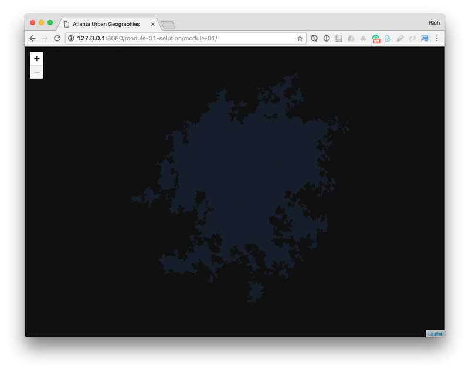  
**Figure 19.** Urban Areas Boundary.

Next we can add the neighborhoods.

```javascript
L.geoJson(neighborhoodsData, {
  style: neighborhoodOptions,
}).addTo(map);
```

Note how we've styled the fill of the neighboords a lighter, brighter color than the previous layers. This allows these polygons to ascend the visual hierarchy, capturing our attention more than the other polygons (being on top helps too). Additionaly, we can use a stroke color that matches the underlying polygon fill color for the borders. In this way, we're able to still define the borders without adding yet another color to the design that may compete with the features we're representing.

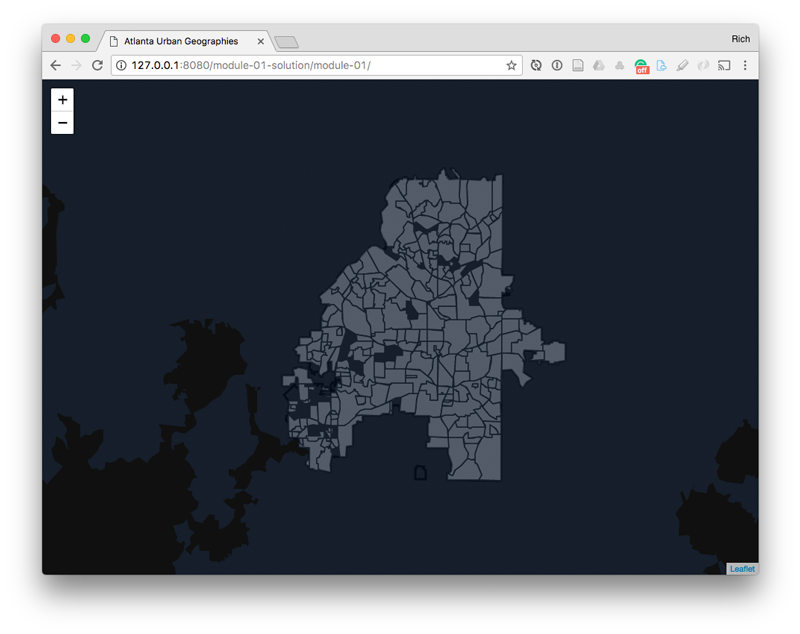  
**Figure 20.** Neighborbood features drawn to the map.

Finally, we'll draw our transportation networks last. We can use JavaScript to determine which type is which and assign different options based on these types:

```javascript
L.geoJson(transitRoutesData, {
  // style each feature
  style: function (feature) {
    // shortcut to variable
    let type = feature.properties.type;

    // assign options
    return type === 'subway, metro'
      ? subwayOptions
      : type === 'bus'
      ? busOptions
      : type === 'tram, light rail, streetcar'
      ? tramOptions
      : otherRoutes;
  },
}).addTo(map);
```

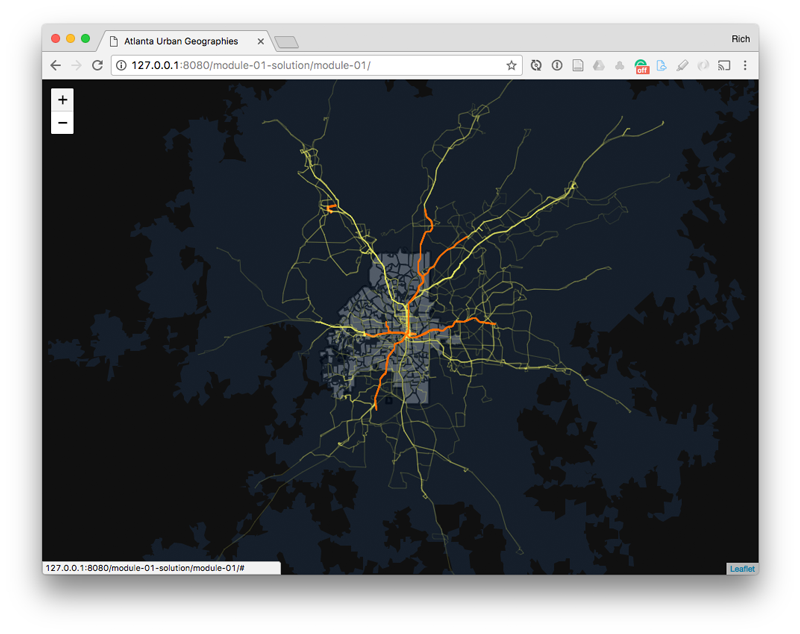  
**Figure 21.** Different types of transportation routes drawn to the map.

Also note how we achieve differences in visual hierarchy between these various polylines we've drawn using varying stroke weight (i.e., width) and color.

### Styling user interaction to match the static design

One final consideration in designing the map: we can also style other elements we may add to the map such as tooltips to match the overall motif. Here we can first modify our code to use Leaflet's `onEachFeature` to add tooltips and visual affordances for mousing over the neightboords. Note how we don't make the hover affordance a bright red that screams at the user. That's not necessary. Practice design subtlety.

```javascript
L.geoJson(neighborhoodsData, {
  style: neighborhoodOptions,
  onEachFeature: function (feature, layer) {
    // shortut to variable
    let tooltip = feature.properties.NEIGHBORHO;
    // bind the tooltip to the layer
    layer.bindTooltip(tooltip, {
      sticky: true,
      className: 'tooltip',
    });
    // visual affordance on mouseover
    layer.on('mouseover', function (e) {
      this.setStyle({
        fillOpacity: 0.1,
      });
    });
    // use existing option to reset the styles on mouseout
    layer.on('mouseout', function (e) {
      this.setStyle(neighborhoodOptions);
    });
  },
}).addTo(map);
```

We can select then Leaflet's tooltip using CSS and override the default styles:

```css
.tooltip {
  color: white;
  background: #295b97;
  border: 0;
  font-size: 1.3em;
}
```

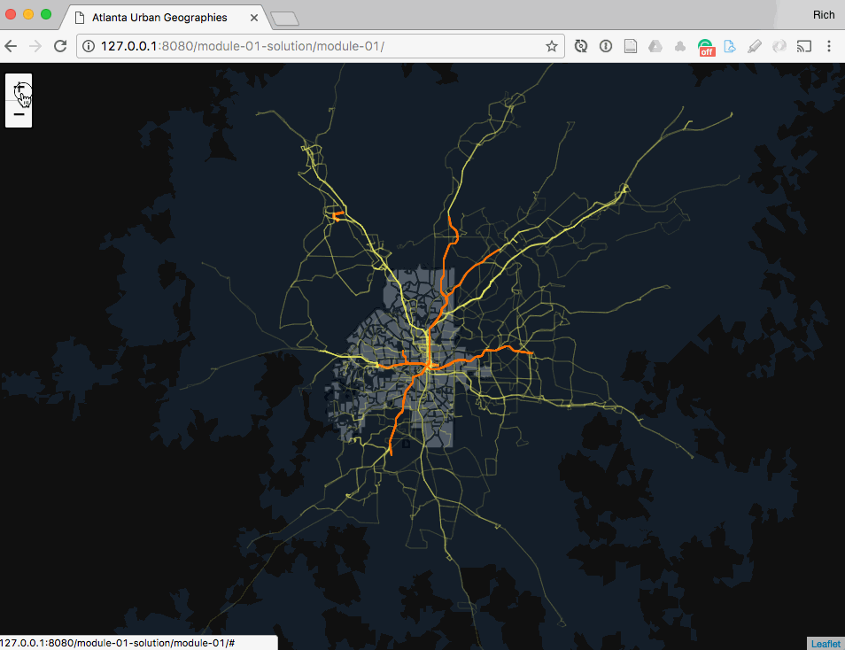  
**Figure 23.** Tooltip and visual affordance for retrieving info about neighborhoods.

In this way we achieve visual consistency across the static and interactive experiences of our map.

### Adding labels only within a map pane

One final element we can consider adding our labels for the map. However, how do we stack these labels above the other layers. Drawing from a brief [Leaflet tutorial on working with map panes](http://leafletjs.com/examples/map-panes/)

So rather than adding a full basemap from CARTO that would sit under all our layers (and potentially cause a lot of competing visual noise between basemap features/labels and our drawn features), we can simply add the labels to sit above all our other layers. We do so using [map panes](http://leafletjs.com/reference-1.2.0.html#map-pane), which can be useful for ensuring some layers stack above or below others.

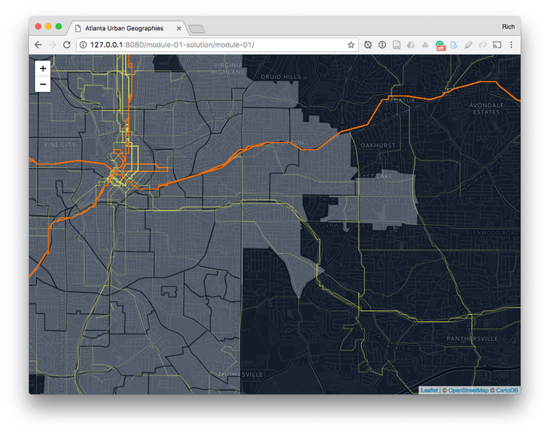  
**Figure 24.** Full underlying basemap causing visual clutter and competition with drawn map features.

Here, we're giving the labels pane a z-index value of 650, which will sit above the overlay pane (which has a z-index of 400) and contains our drawn polygons/lines.

```javascript
map.createPane('labels');
map.getPane('labels').style.zIndex = 650;
map.getPane('labels').style.pointerEvents = 'none';

L.tileLayer(
  'http://global.ssl.fastly.net/rastertiles/dark_only_labels/{z}/{x}/{y}.png',
  {
    attribution: '©OpenStreetMap, ©CartoDB',
    pane: 'labels',
  }
).addTo(map);
```

Just adding the layers atop our map achieves a more effective balance between all the visual elements.

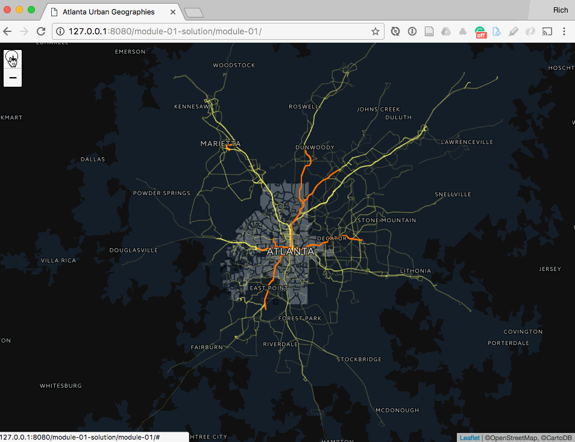  
**Figure 25.** Labels only added atop the styled map.

## Moving on to the assignment

This section returned to the frontend side of map development to quickly cover how we can improve the visual experience with the map. We considered the visual hierarchy and the order in which features are drawn to the map. We used subtle variations of fill and stroke color and opacity to establisht the ground (in this case the urban extent, city boundaries, and neighboords). And we use a more strongly contrasting stroke color(s) for our transportation routes, which rise to figure on the map and are likely the first point of engagement with a user.

This concludes the "lesson" part of the first two week module for MAP 675. Assignment 01 is included in this repository (assignment-01.md) and should constitute your work for the second week of this 2-week module.
